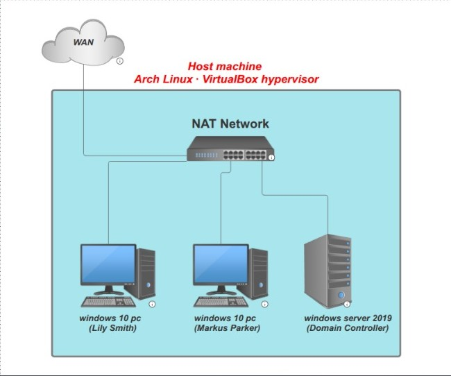
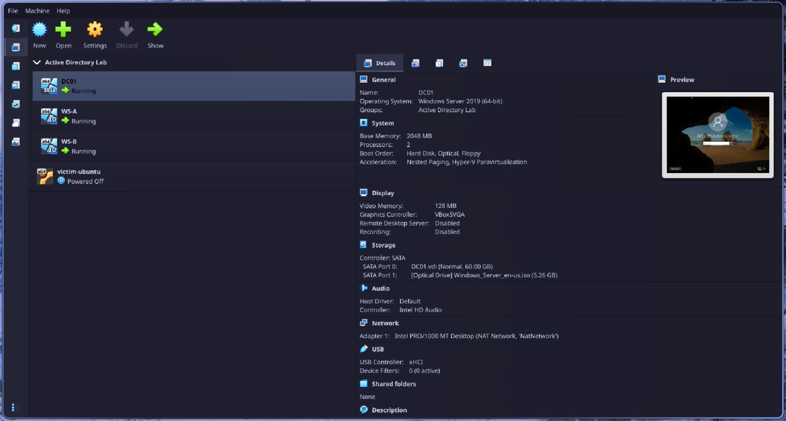
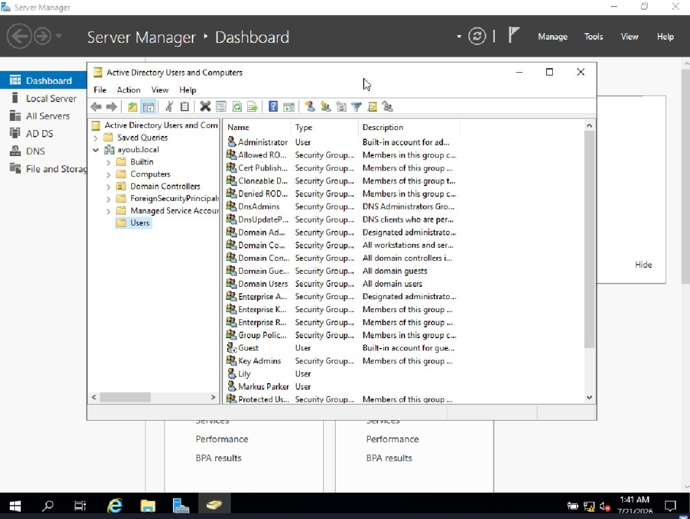

# Building a Miniature Active Directory Environment for Blue Team Practice

*A hands-on lab documenting the build of a Windows enterprise domain — one Server 2019 domain controller and two Windows 10 workstations — inside VirtualBox on Arch Linux.*


---

## Table of contents

- [Why I built this](#why-i-built-this)
- [Environment](#environment)
- [The build, step by step](#the-build-step-by-step)
- [Lessons learned](#lessons-learned)
- [What's next](#whats-next)
- [Repo structure](#repo-structure)

---

## Why I built this

Most blue team and DFIR work happens inside Windows enterprise environments, and the domain controller is the center of gravity for almost everything: authentication, logging, policy, and — when things go wrong — the attacker's favorite target. Reading about Active Directory only gets you so far. I wanted a real, if small, domain to poke at: create users, watch logon events, and eventually practice detection and investigation against something I fully control.

This project (based on Security Blue Team's BTL1 optional lab) walks through standing up that environment from nothing: a bare hypervisor to a working Windows domain with two joined workstations.

## Environment

| Component | Spec |
|---|---|
| Host OS | Arch Linux |
| Hypervisor | Oracle VirtualBox |
| Domain Controller | Windows Server 2019 Standard (Desktop Experience), 2 vCPU, 2GB RAM, 60GB disk |
| Workstation A | Windows 10 Pro, 2 vCPU, 2GB RAM, 20GB disk |
| Workstation B | Windows 10 Pro, 2 vCPU, 2GB RAM, 20GB disk |
| Domain name | `ayoub.local` |
| Networking | VirtualBox NAT Network (`NatNetwork`, 10.0.2.0/24) — required so VMs can reach each other, unlike plain NAT which isolates them |
| DC01 IP address | `10.0.2.3` |


*(Diagram: host machine running three VMs on a shared NAT network — DC01 as domain controller, WS-A and WS-B as domain-joined workstations)*

## The build, step by step

### 1. Provisioning the VMs

Created three VMs in VirtualBox, each attached to a custom **NAT Network** rather than the default NAT adapter — this was the first real gotcha of the build. VirtualBox's plain NAT mode sandboxes each VM individually with no visibility into sibling VMs, which silently breaks domain joins later. Setting up a NAT Network first (`File → Tools → Network Manager → NAT Networks → Create`) solved this cleanly.



### 2. Installing Windows Server 2019 as the domain controller

Standard install: Windows Server 2019 Standard, Desktop Experience (not Server Core — the GUI is needed for this lab), custom install onto the 60GB disk. First boot required setting a compliant local Administrator password (Windows enforces 3-of-4 complexity: upper/lower/number/symbol, 8+ characters).

### 3. Promoting to a Domain Controller

Installed the **Active Directory Domain Services** role via Server Manager, then ran the "Promote this server to a domain controller" wizard:

- Deployment: new forest
- Root domain: `ayoub.local`
- DNS server role: enabled (required for domain name resolution)
- Set a separate DSRM (Directory Services Restore Mode) recovery password

The server rebooted automatically, and the login prompt changed from `Administrator` to `AYOUB\Administrator` — first visible confirmation the domain existed.


### 4. Creating domain users

Using **Active Directory Users and Computers**, created two standard domain accounts (`Lily`, `Markus`) under the default `Users` container, each with "password never expires" set for lab convenience.



### 5. Installing and preparing the workstations

Installed Windows 10 Pro (Home edition can't join a domain — this matters) on both `WS-A` and `WS-B`. During setup, chose "Set up for an organization" → "Domain join instead" to skip creating a Microsoft account and land on a local account instead.

Each workstation then needed its DNS pointed at the domain controller's IP (`10.0.2.3`) manually (`Network Adapter → IPv4 Properties → Preferred DNS server`), since a domain can't be discovered without DNS resolution to it. Verified reachability with `ping 10.0.2.3` before attempting to join.

### 6. Joining the domain

`Settings → Accounts → Access work or school → Connect → Join this device to a local Active Directory domain`, entered `ayoub.local`, authenticated with `ayoub\Administrator`, and assigned each workstation to its intended domain user (`Lily` on WS-A, `Markus` on WS-B) with local administrator rights.


### 7. Validation

Confirmed both machines registered correctly by checking **Active Directory Users and Computers → Computers** on the domain controller — both workstation objects appeared automatically post-join.


Post-reboot, both workstations' login screens displayed the domain-qualified username format (`AYOUB\Lily`, `AYOUB\Markus`), confirming the domain identity was active end to end.


## Lessons learned

> [!IMPORTANT]
> **VirtualBox's default NAT isolates VMs from each other.** This is the single most common blocker for anyone adapting VMware-based lab guides to VirtualBox — the fix is a dedicated NAT Network, not the per-VM NAT adapter.

> [!NOTE]
> **DNS is the real dependency for domain discovery**, not just IP reachability. A workstation can `ping` the DC successfully and still fail to find the domain if its DNS server isn't pointed at the DC.

> [!TIP]
> **Local accounts and domain accounts are two entirely separate identity systems.** The local account created during Windows 10 setup has zero authority over the domain — only credentials that exist inside Active Directory (like the domain Administrator) can approve a domain join.

> [!TIP]
> **Snapshots are cheap insurance.** Taking a snapshot immediately after each VM reaches a known-good state (freshly promoted DC, freshly joined workstation) means any later experimentation — intentional or accidental — has a safe rollback point.

## What's next

With the domain live, the natural next steps are:
- Configuring Group Policy Objects (GPOs) to push settings across the domain
- Enabling and reviewing Windows Event Logs / Security auditing on the DC for authentication events
- Practicing basic DFIR workflows: simulating a login, then tracing it through Event Viewer

## Repo structure

```
.
├── README.md
└── screenshots/
    ├── 00-topology.png
    ├── 01-virtualbox-overview.png
    ├── 02-addc-installed.png
    ├── 03-domain-users.png
    ├── 04-domain-join.png
    ├── 05-computers-in-ad.png
    └── 06-domain-login.png
```

---

*Built as part of Security Blue Team's BTL1 (Blue Team Level 1) optional coursework.*
